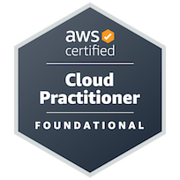

# [Ponder Estan Stine](https://www.linkedin.com/in/ponder-e-stine/)
## 📍 Redmond, WA

### 👨🏻‍💻📡 Embedded Software Engineer @Amazon
### 🎓🚀🛰️ BS/MS in aerospace engineering with a concentration in bioastronautics and a minor in Computer Science from the Univ. of Colorado, Boulder '22 ⛰️

====================================================================================================
## Passionate about human spaceflight and increasing human access to space. Prior aerospace research in academia and defense projects. Experience in embedded software design, development, testing, and operations.
====================================================================================================

## Professional experience:
- Embedded Software Development Engineer - Amazon (June 2022 - Present)
- Embedded Cubesat Flight Software Engineer - Univ. of Colorado, Boulder (August 2021 - May 2022)
- NTS-3 Space Scholar - Air Force Research Laboratory (May 2021 - August 2021)
- Undergraduate Research Assistant - Univ. of Colorado, Boulder (March 2019 - March 2020)

     
## Contact
[Stine.Ponder@gmail.com](mailto:stine.ponder@gmail.com)  
[PondStin@Amazon.com](mailto:pondstin@amazon.com)  
[Linkedin](https://www.linkedin.com/in/ponder-stine-588b551aa/)
